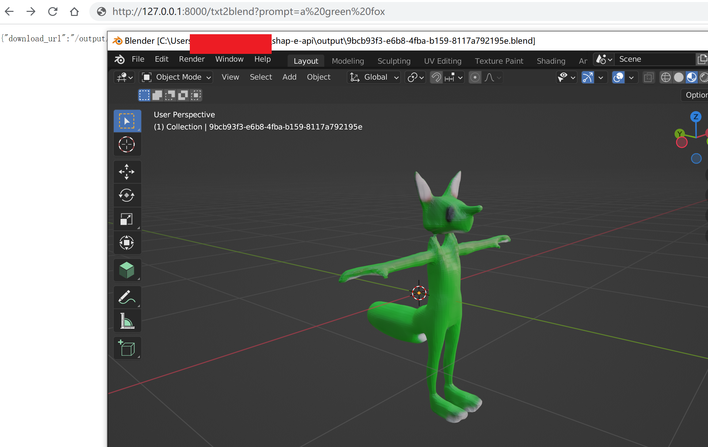

### shap-e-api: 将OpenAI开源的Shap-E封装为http api，同时结合3d和游戏开发工作流做了一些易用封装
[](https://github.com/SCIR-HI/Huatuo-Llama-Med-Chinese/blob/main/LICENSE)

<p align="center" width="100%">
  
</p>

### 使用方式
首先确保
1. blender 加入环境变量
2. 安装 openai shap-e

安装依赖而后运行
```
pip install -r requirements.txt
python main.py
```

目前仅提供了一个接口

/txt2blend，接收prompt参数，接口将返回可下载的blender文件


